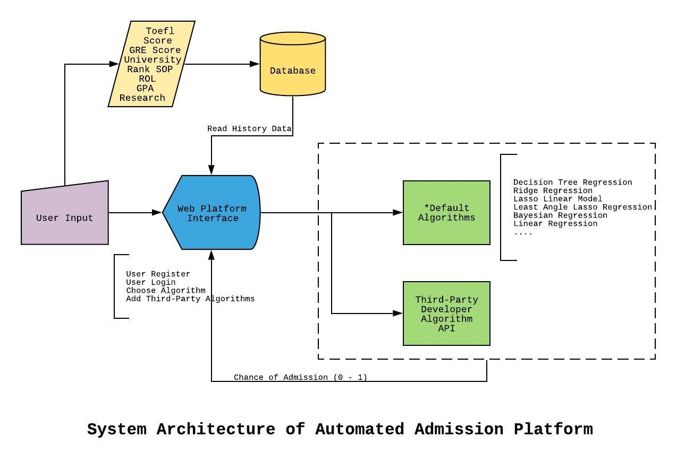

# EC601_Project

Project Name:Automated Admission System

Project Member:Qingxuan Pei, Haoyang Wang, Kefan Zhang

# Sprint 1

## Outcome:

·Product Definition Document(Product Mission, Customer(s), MVP user stories)

·All system setup

·Review and analysis industrial products

·Test programs

## Schedule:

Stage #1:(Sep 20th - Oct 4th)

Assignment: Product Definition Document, System Setup and Test Programs.

Stage #2:(Oct 8th - Nov 4th)

Assignment: System architecture (HTTP request to return score, data storage and export function), more algorithms,
            explore feasibility of NLP for LOR, SOP (VMOCK), extension on Telegram (*undecided)

System Architecture:

Format: 

            
